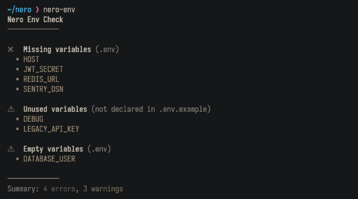

# nero-env

A simple CLI tool to validate environment variables in a project.

## Table of Contents
- [Quick Start](#quick-start)
- [Features](#features)
- [Installation](#installation)
- [Usage](#usage)
- [What it Checks](#what-it-checks)
- [Local Development](#local-development)
- [Contributing](#contributing)

## Quick Start

### 1. Install
```bash
npm install -g nero-env
```

### 2. Setup .env Files
```bash
# Create your .env file
echo "DATABASE_URL=postgres://localhost" > .env

# Create .env.example
echo "DATABASE_URL=" > .env.example
echo "API_KEY=" >> .env.example
```

### 3. Run
```bash
neo-env
```

## Features

✅ **Zero Configuration** - No setup needed, just run it

✅ **Fast Validation** - Instantly checks your environment variables

✅ **Clear Reports** - Easy-to-read output showing what's missing

✅ **Safe by Default** - Doesn't modify your files

## Installation

```bash
npm install -g nero-env
```

## Usage

Validate environment variables in the current project:

```bash
nero-env
```

Check a specific project:

```bash
nero-env --path ./apps/api
```

## What it Checks

nero-env compares your active `.env` file with `.env.example` and reports:

- **Missing** → Defined in `.env.example` but not in `.env`
- **Empty** → Defined but has no value
- **Unused** → Present in `.env` but not declared in `.env.example`

Clear output clearly shows which file needs fixing.

## Local Development

### Prerequisites

- **Node.js** (v14 or higher)
- **pnpm** - Install from [pnpm.io/installation](https://pnpm.io/installation)

### Setup Steps

1. **Fork the repo**

2. **Clone your fork**
   ```bash
   git clone https://github.com/YOUR_USERNAME/nero-env.git
   cd nero-env
   ```

3. **Install dependencies**
   ```bash
   pnpm install
   ```

4. **Build the project**
   ```bash
   pnpm build
   ```

### Testing Locally

Link the package for local testing:

```bash
# Create global link
npm link

# Test the command
nero-env

# After making changes
pnpm build

# Cleanup when done
npm unlink
```

## Example



## Contributing

Contributions are welcome! Please check the [CONTRIBUTING.md](./CONTRIBUTING.MD) file for guidelines.

---

**Made with ❤️ for developers who care about their environment variables**
